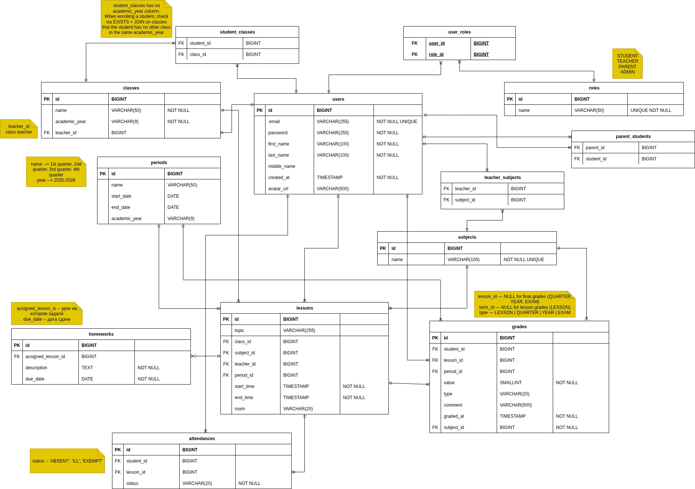

# EduGo

**EduGo — Grades to know.**

EduGo is a school diary platform designed to help teachers, students, and parents stay connected and informed about academic progress.

## Motivation

The idea of creating a school diary application first came to me around 2010. At that time I was working as a school teacher and building websites with Joomla CMS. I was fascinated by the possibilities it offered. Among the available plugins there was something similar to a school register, and I immediately thought about using it for my own school.

However, it lacked many features I needed, and developing such a system myself felt completely impossible back then — I didn't know PHP or any other programming language.

Years later I started learning Java and became interested in software development. EduGo is both a long-standing idea and a personal challenge I finally decided to take on. At the same time, it is a pet project created as part of my journey from teaching to programming. **By the way, this is my second attempt at building an application from scratch**, and I am determined to see it through:-).

## 🛠 Tech Stack

**Backend**

- Java 17
- Spring Boot
- Spring Web
- Spring Security
- Spring Data JPA

**Database**

- PostgreSQL
- Liquibase

**Build & Tools**

- Maven
- Lombok

**Testing**

- JUnit
- Spring Security Test

## Database Schema

Here is the database structure for EduGo:



## Local configuration

Create a local configuration file for spring boot:

```bash
cp application-local.yml.example application-local.yml
```
Then fill in your local database credentials.

```bash
cp application-local.yml.example application-local.yml
```
Edit the .env file with your own database credentials for docker-compose file.